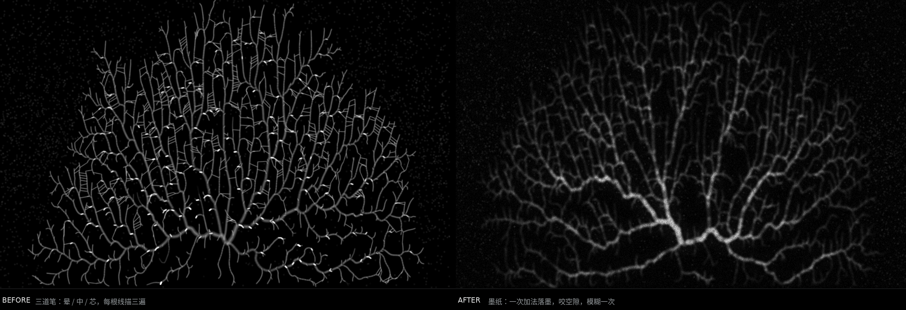

# The Beauty of Systems

**Three interactive generative systems in which leaf venation, brain folds and honeycomb turn out to be three answers to one question: what shape does a constraint make?**

By Yuan Zheng 


*The same module and the same preset, rendered by two versions of the pipeline: three strokes per line (left) and one additive pass into a half-resolution ink sheet (right).*

---

## Description

A fingerprint looks like the growth rings of a tree; the seed spiral of a sunflower looks like the arm of a galaxy; skin looks like cracked ground. This project does not treat those resemblances as coincidence — it asks what kind of process produces them, and answers with three living systems you can operate.

Each module grows a structure in real time out of a finite, contested nutrient field. Nothing is drawn from a stored image: every frame is the current state of a simulation. You choose a natural form as a starting point, then move the parameters and watch the structure rearrange itself.

| Module | Algorithm | Constraint | Forms it grows |
|---|---|---|---|
| **I** | Space colonisation | Transport | Leaf venation · vasculature · river basins · ridges |
| **II** | Differential growth | Bounded expansion | Cortical folding · villi · coral · kale · colonies |
| **III** | Voronoi tessellation + Lloyd relaxation | Partition | Honeycomb · dry and wet foam · cracked earth · skin |

The three are not three demos. They share one kernel — a single scarce nutrient field the cells compete over, one metabolism, one three-stage birth and death, one scaling law — and one vocabulary of parameters, so a fader means the same thing in every module and keeps its value when you switch.

## Concept

"Coincidence" explains nothing, and "fractal" only renames the question. A better account comes from D'Arcy Thompson: **form is the visible record of the forces that made it** (Thompson, 1917).

A system that must carry material between a source and scattered demands grows a branching network. A sheet that grows faster than the space allowed to it folds. Equal claims competing over one plane partition it into cells. The species is accidental; the constraint is not — which is why the likeness between a leaf and a lung is not a metaphor but the same answer to the same problem.

Each module implements one of those constraints directly as an algorithm, so the resemblance is not asserted, it is produced. Two design decisions follow from that:

- **Axes are named phenomenologically** — *abundance, clustering, turnover, grain, weave* — not by implementation. The panel describes the world the structure lives in, not the code.
- **Presets are departures, not settings.** Clicking one sends the whole parameter set travelling to its destination over five seconds while the structure rearranges, because natural form is not six categories but a continuous spectrum, and the states in between are often better than either end. Module I's *weave* axis is the clearest case: at 0 it is a pure tree (a river system), at 1 a full network (vasculature), and in between, reticulate leaf venation.

## Install

No build step, no dependencies to install — the libraries are vendored in the repository.

```bash
git clone https://github.com/<your-account>/the-beauty-of-systems.git
cd the-beauty-of-systems
python3 -m http.server 8000
```

Then open **http://localhost:8000/** and press `1`, `2` or `3` to move between modules.

A local server is required: the shell loads each module in an iframe and passes shared parameters between them, which browsers block over `file://`. Any static server will do.

To enable the QR export used in the exhibition (a visitor scans a code and takes away the frame they made), run the included server instead:

```bash
python3 serve.py             # same machine or same Wi-Fi
python3 serve.py --tunnel    # public URL, for mobile data at a show
```

### Controls

| Key | Action |
|---|---|
| `1` `2` `3` | Switch module |
| `H` | Show / hide the panel |
| `R` | Replant |
| `T` | Tour — travel between presets on its own |
| `E` | Export the current frame (and show its QR code) |
| `F` | Quality step (LIGHT / RICH) |
| `Q` | Fullscreen |

Query parameters: `?exhibit` starts with no panel and tours on its own · `?lite` lowers density for weak machines · `?fast` / `?rich` pin the quality step · `?perf` shows per-stage timings in milliseconds.

### Repository structure

```
index.html      the shell: loads the three modules, switches them, carries shared axes across
1/ 2/ 3/        the three modules, each a self-contained sketch.js plus its libraries
serve.py        exhibition image server: receives exported PNGs, returns short shareable URLs
figures/        process images
```

Every `sketch.js` is assembled from four parts, marked with `§` section headers: the shared kernel (§1–§9, byte-identical across all three files), the module's own axes, lifecycle, simulation and rendering (§10–§13), the control panel and the preset transitions (§14–§15), and the link to the shell (§16). **The shared kernel is duplicated by hand — if you change it, change all three.**

## Requirements

- A current desktop browser (Chrome, Edge, Safari or Firefox). Canvas 2D only; no WebGL, no shaders.
- Python 3.8+ — only to serve the files, and for `serve.py`.
- `cloudflared` — optional, only for `serve.py --tunnel`.
- Rendering is CPU-rasterised and scales with pixel count, so a large display costs more than a small one. The piece adapts its own quality to the frame rate; press `F` for the richer step on a fast machine, or add `?lite` on a slow one.

## Screenshots


## Credits

**Libraries** (vendored in this repository, under their own licences)

- [p5.js](https://p5js.org/) — Lauren McCarthy and the Processing Foundation
- [d3-delaunay](https://github.com/d3/d3-delaunay) — Mike Bostock (Module III)
- [qrcode-generator](https://github.com/kazuhikoarase/qrcode-generator) — Kazuhiko Arase (used to compute the QR matrix only; the code itself is drawn by this project so it matches the palette)

**Algorithms**

- Runions, A., Fuhrer, M., Lane, B., Federl, P., Rolland-Lagan, A.-G. and Prusinkiewicz, P. (2005) 'Modeling and visualization of leaf venation patterns', *ACM Transactions on Graphics*, 24(3), pp. 702–711.
- Runions, A., Lane, B. and Prusinkiewicz, P. (2007) 'Modeling trees with a space colonization algorithm', *Eurographics Workshop on Natural Phenomena*, pp. 63–70.
- Lloyd, S. P. (1982) 'Least squares quantization in PCM', *IEEE Transactions on Information Theory*, 28(2), pp. 129–137.
- Hoff, A. (2016) [*On Generative Algorithms: Differential Line*](https://inconvergent.net/generative/differential-line/).
- Shiffman, D. (2016) [*Coding Challenge #17: Fractal Trees — Space Colonization*](https://thecodingtrain.com/challenges/17-fractal-trees-space-colonization/) — studied as an introduction to space colonisation; the implementation here was written from the papers above.

**Concept**

- Thompson, D'A. W. (1917) *On Growth and Form*. Cambridge University Press.
- Haeckel, E. (1904) *Kunstformen der Natur*.
- Jenson, S. (2021) [*36 Points*](https://www.sagejenson.com/36points/) — the standard this project set itself: a simulation becomes a work at the moment a hand is laid on it while it is still alive.

Code and images © 2026 Yuan Zheng. The photographs used in the exhibition poster are separately licensed and are not part of this repository.

## Contact

- Vedio demo: https://vimeo.com/1224950982?share=copy&fl=sv&fe=ci